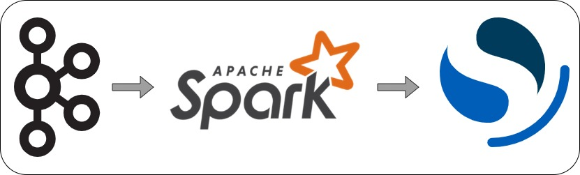
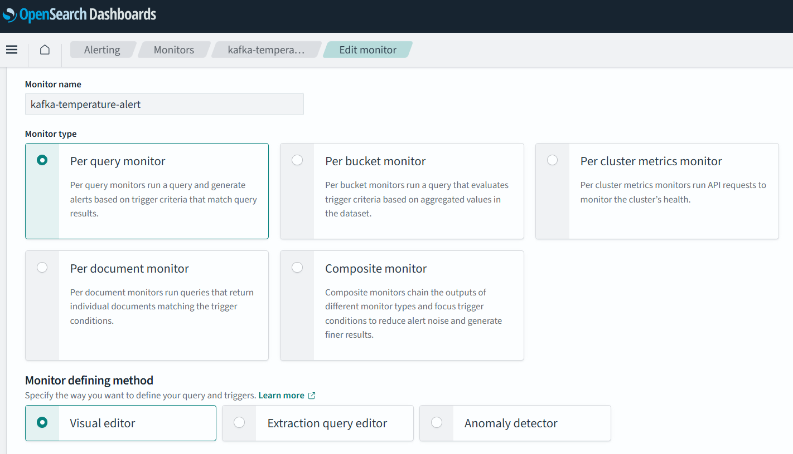
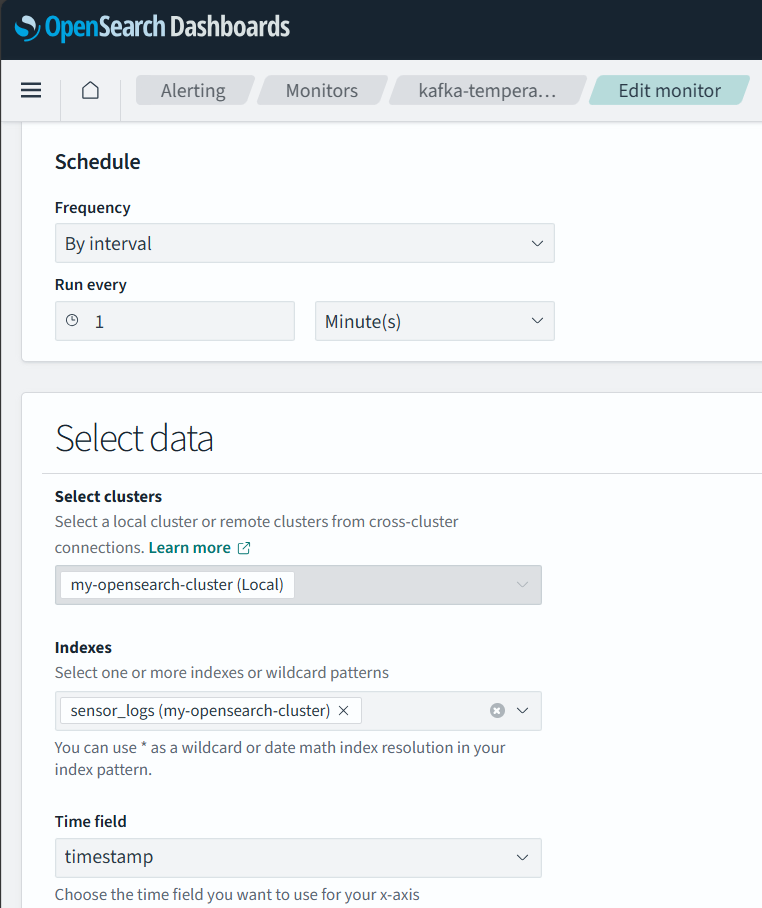
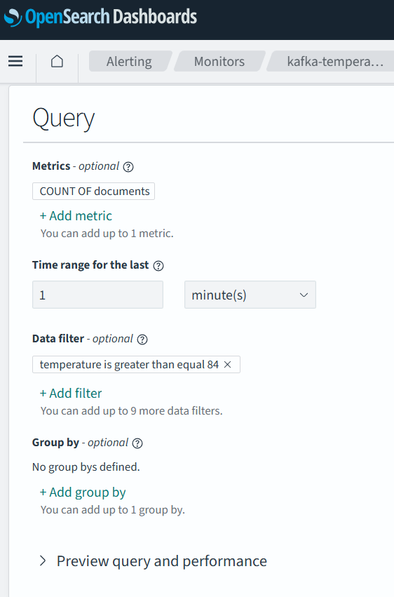
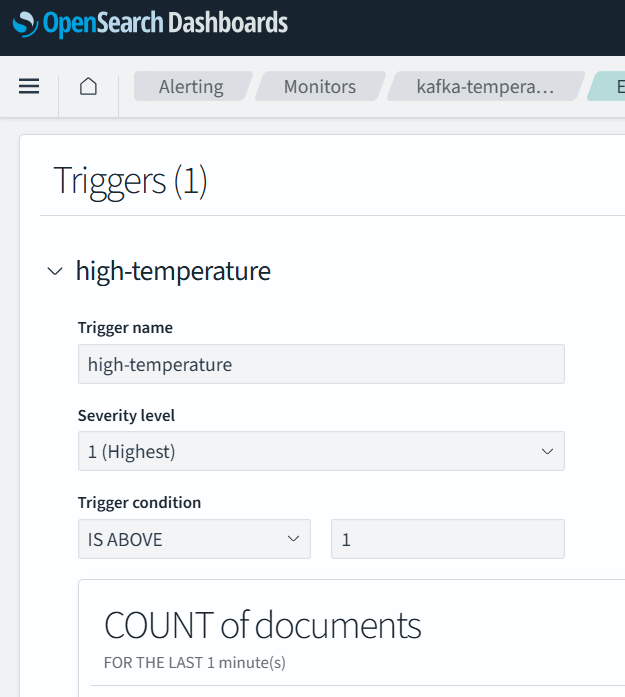
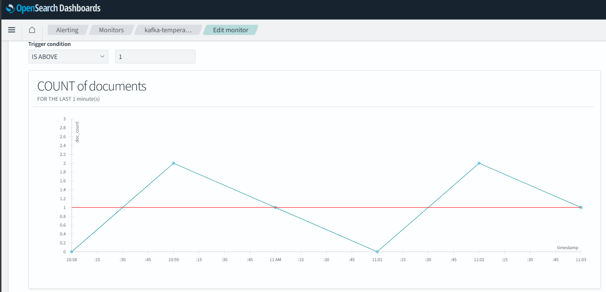

# __Log Streaming (Kafka, Spark, and Opensearch) and Alerting__

 

__This example is running from WSL 2__<br>
__Requirements running in your system__:
1. WSL 2 (Windows 11)
2. Python 3.10
3. Kafka 3.5.1
4. Spark 3.5.1
5. Opensearch 2.19

__There will be 4 step to run this example__:
1. Kafka Configuration
2. Generate Log as Source
3. Spark Stream Read Kafka and Send to Opensearch
4. Opensearch Configuration for Alert


### 1. Kafka Configuration

Let's set up the Kafka by creating new topic called `sensor-data`. Topic is used to store log. To create topic, use:
```
~/kafka/bin/kafka-topics.sh --bootstrap-server localhost:9092 --create --topic sensor-data
```

### 2. Generate Log as Source

Since i dont have real log from IOT, you can configure your source log from anything (IOT MQTT, API, Metric, etc) and send to Kafka's topic. In here i'am using python to generate the logs. Don't forget to install `kafka` library in your python.

For the complete Python programming code, refer to the following block.
<details>
   <summary>Click to view the complete Python code.</summary>

   ```python
import random
import time
import json
from datetime import datetime, timezone
from kafka import KafkaProducer

KAFKA_BOOTSTRAP_SERVERS = ['localhost:9092']
TOPIC_NAME = "sensor-data"

# Setup Producer
producer = KafkaProducer(
    bootstrap_servers=KAFKA_BOOTSTRAP_SERVERS,
    value_serializer=lambda x: json.dumps(x).encode('utf-8')
)

def generate_data():
    temperature = round(random.uniform(24.0, 85.0), 2)
    humidity = round(random.uniform(30.0, 90.0), 2)
    
    timestamp = datetime.now(timezone.utc).isoformat() #timezone setting
    
    return {
        "timestamp": timestamp,
        "temperature": temperature,
        "humidity": humidity
    }

print(f"Mulai mengirim data ke topik: {TOPIC_NAME} (Tekan Ctrl+C untuk berhenti)")

try:
    while True:
        data = generate_data()
        
        producer.send(TOPIC_NAME, value=data)
        
        print(f"Sent: {data}")
        
        time.sleep(1)
except KeyboardInterrupt:
    print("\nForced Stop.")
    producer.close()
   ```
   </details>
   
__For ez downliad, you can access the code by click this [link](https://github.com/MuhammadMukhlis220/Spark/blob/main/kafka-spark-streaming/log_generator_kafka.py)__.

Place and run the file uisng:
```
python log_generator_kafka.py
```

If it successfull, it will show:


Figure 1

### 3. Spark Stream Read Kafka and Send to Opensearch

If you dont familiar with spark, you can change spark by using [kafka connect](https://docs.confluent.io/platform/current/connect/index.html) or [data prepper](https://docs.opensearch.org/latest/data-prepper/). <br>
The main difference between batch processing and stream processing in Spark lies in the APIs used. Batch processing uses the standard `spark.read` and `spark.write` APIs, while stream processing uses `spark.readStream` and `spark.writeStream`.

The Spark–OpenSearch connector only supports batch processing ([opensearchpy](https://pypi.org/project/opensearch-py/), [opensearch-hadoop](https://github.com/opensearch-project/opensearch-hadoop), and [opensearch-spark](https://github.com/opensearch-project/opensearch-spark)). For streaming workloads, we still use the `writeStream` and `readStream` APIs, but the actual writing is handled using micro-batching through `foreachBatch` API.

Spark Structured Streaming uses a micro-batch execution model, where incoming data is first accumulated for a short interval and then processed as a batch. Inside `foreachBatch`, Spark provides each micro-batch as a DataFrame, and we can write that DataFrame to OpenSearch using the batch connector.

If no trigger interval is specified, Spark will execute micro-batches continuously. That means as soon as one micro-batch completes, Spark immediately processes the next batch with whatever new data has arrived, without any delay. This allows the pipeline to __run as close to real time as possible__.

<details>
   <summary>Click to view the complete Pyspark code.</summary>

   ```python
from pyspark.sql import SparkSession
from pyspark.sql.functions import from_json, col
from pyspark.sql.types import StructType, StructField, StringType, DoubleType


# Config
kafka_bootstrap = "localhost:9092"
topic_name = "sensor-data"

spark = SparkSession.builder \
    .appName("test-kafka-opensearch") \
    .master("local[2]") \
    .getOrCreate()

spark.sparkContext.setLogLevel("WARN")

spark.sparkContext.setLogLevel("ERROR")

schema = StructType([
    StructField("timestamp", StringType(), True),
    StructField("temperature", DoubleType(), True),
    StructField("humidity", DoubleType(), True)
])

kafka_df = spark.readStream \
    .format("kafka") \
    .option("kafka.bootstrap.servers", kafka_bootstrap) \
    .option("subscribe", topic_name) \
    .option("startingOffsets", "latest") \
    .load()

df = kafka_df.selectExpr("CAST(value AS STRING)") \
    .select(from_json(col("value"), schema).alias("data")) \
    .select("data.*")

def send_partition_to_opensearch(iterator):
    from opensearchpy import OpenSearch, helpers
    
    client = OpenSearch(
        hosts=[{'host': '172.28.176.140', 'port': 9200}],
        http_compress=True,
        use_ssl=False
    )
    
    actions = []
    for row in iterator:
        doc = row.asDict()
        action = {
            "_index": "sensor_logs",
            "_source": doc
        }
        actions.append(action)
        
        if len(actions) >= 500:
            helpers.bulk(client, actions)
            actions = []
            
    if actions:
        helpers.bulk(client, actions)

def process_batch(batch_df, batch_id):
    batch_df.foreachPartition(send_partition_to_opensearch)

print("Streaming starting...")
query = df.writeStream \
    .foreachBatch(process_batch) \
    .option("checkpointLocation", "/tmp/checkpoint_spark_stream") \
    .queryName("kafka-sensor-v1") \
    .start()

query.awaitTermination()

   ```
   </details>

You can run the code using:
```
spark-submit --packages org.apache.spark:spark-sql-kafka-0-10_2.12:3.5.1 kafka_to_opensearch.py
```

Ahh, don't forget to install [opensearchpy](https://pypi.org/project/opensearch-py/) library.

__RESULT STREAMING__:

https://github.com/user-attachments/assets/15d079be-c6f9-485e-b44d-235af71b21c3

### 4. Opensearch Configuration for Alert

We can run the spark file without error even we not make the index `sensor_logs`. But if you want implement in production, you need build the index manually to configure the data type mapping, replica and shard. After sent to Opensearch, we can go to __Alerting__ menu in __OpenSearch Plugins__'s section. Because i already make the alert monitor, my figure will show __edit__ the alerting monitor.

**Here, we take the aim to get alert when temperature is greater than equal of 84**.

#### 1. Create Monitor - Monitor name and type

Create new monitor, fill name section (mine is kafka-temperature-alert), select `per query monitor`, and `visual editor` as shown figure.


Figure 2

#### 2. Create Monitor - Schedule and Select Data

Select frequeny `by interval` and make it every minute. Choose `sensor_logs` as your index and choose `timestamp` as time field.


<br>
Figure 3

#### 3. Create Monitor - Query Metric and Filter

Add metric by `count of document` with time rang for the last `1 minutes`. Filter the data by field `temperature` is `greater than equal 84`.


<br>
Figure 4

#### 4. Create Monitor - Triggers

Let's create the trigger, we will get trigger if there are at least 1 document is spotted greater than equal of 84 degree.
Fill the name box, fill severity level (up to you, 1 is highest), trigger condition `is above 1`.


<br>
Figure 5

#### 5. Create Monitor - Preview our graph


<br>
Figure 6

#### 6. Result

We can watch our monitor in **Alerting** menu. In this example, there are 3 times between the gap time i already choose is triggered.


<br>
Figure 7

OpenSearch not only provides an alerting dashboard, but also allows you to define actions that are triggered when an alert occurs. In my case, I did not configure any custom actions. The default action is to send a notification email.

__That all, give it a try!__


